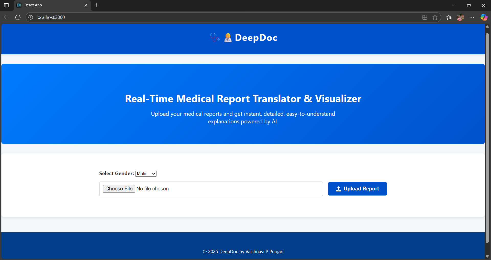
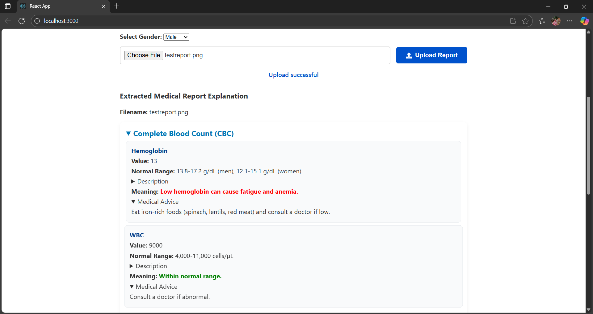
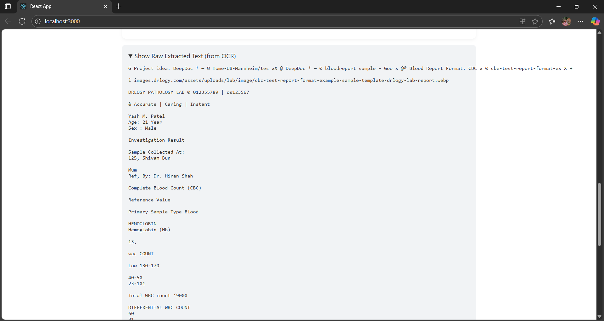

#  🩺👩‍⚕️DeepDoc — Real-Time Medical Report Translator & Visualizer

An AI-powered web app that lets users upload medical reports and instantly receive simplified explanations, parameter highlights, and personalized health advice.
---

##  Repository Overview
```DeepDoc/
│
├── backend/
│ ├── main.py # FastAPI backend logic
│ ├── requirements.txt # Python dependencies
│ └── uploads/ # Stores uploaded reports
│
├── frontend/
│ ├── public/ # Static frontend assets
│ ├── src/ # React source code
│ ├── package.json # Frontend dependencies
│ └── .gitignore # Ignored frontend files
│
├── .gitignore # Root ignore rules
└── README.md # Project overview
```

---

##  Features

- **Image/Text Upload**: Upload report images for analysis.
- **OCR Extraction**: Converts images to extract medical text.
- **Parameter Analysis**: Identifies key medical metrics (e.g., hemoglobin, WBC) and categorizes them.
- **Human-Friendly Recommendations**: Displays easy-to-understand meanings and medical advice directly on the page.
- **Gender-Aware Interpretation**: Uses gender input to adjust normal range evaluations.
- **Frontend Grouping**: Organized UI by category — CBC, Liver, Kidney, and more.

---

## Tech Stack

**Frontend**  


**Backend**  


---

##  Setup & Run Locally

### Clone Repository
```bash
git clone https://github.com/Vaishnaviiii-23/DeepDoc.git
cd DeepDoc
cd backend
python -m venv env
. env/Scripts/activate 
pip install -r requirements.txt
uvicorn main:app --reload
```
Backend will run at: http://localhost:8000

### Frontend
```bash
cd frontend
npm install
npm start
```
Open in browser: http://localhost:3000

## 📸 Screenshots

### Frontend  


### Uploaded report and extracted parameters  


### OCR Results


## Contribution Guidelines

Feel free to contribute! Please:

Fork the repo

Create a new branch (feature/…)

Make changes and push your branch

Open a Pull Request

## 🧑‍💻 Author
Vaishnavi P Poojari